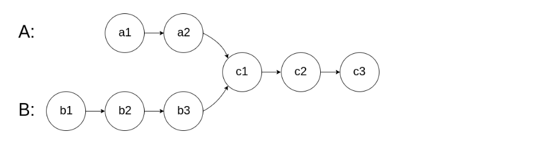
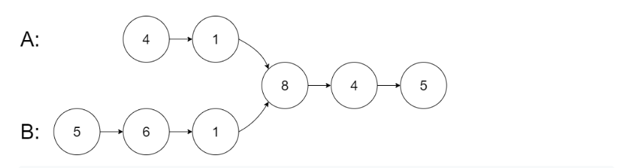
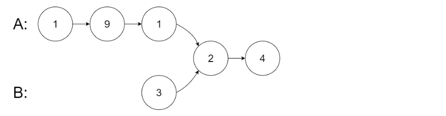
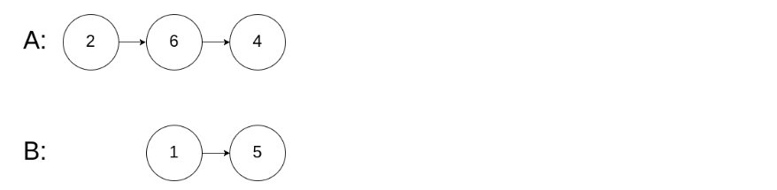

### LeetCode 
## Problem 160: Intersection of Two Linked Lists

https://leetcode.com/problems/intersection-of-two-linked-lists/

Difficulty: Easy

---

Write a program to find the node at which the intersection of two singly linked lists begins.

For example, the following two linked lists:

<!--  -->

begin to intersect at node c1.

 

#### Example 1:

<!--  -->

<pre>
<b>Input:</b> intersectVal = 8, listA = [4,1,8,4,5], listB = [5,6,1,8,4,5], skipA = 2, skipB = 3
<b>Output:</b> Reference of the node with value = 8
<b>Input Explanation:</b> The intersected node's value is 8 (note that this must not be 0 if the two
                   lists intersect). From the head of A, it reads as [4,1,8,4,5]. From the head
                   of B, it reads as [5,6,1,8,4,5]. There are 2 nodes before the intersected 
                   node in A; There are 3 nodes before the intersected node in B.
</pre>

 

#### Example 2:

<!--  -->

<pre>
<b>Input:</b> intersectVal = 2, listA = [1,9,1,2,4], listB = [3,2,4], skipA = 3, skipB = 1
<b>Output:</b> Reference of the node with value = 2
<b>Input Explanation:</b> The intersected node's value is 2 (note that this must not be 0 if the two 
                   lists intersect). From the head of A, it reads as [1,9,1,2,4]. From the head 
                   of B, it reads as [3,2,4]. There are 3 nodes before the intersected node in A; 
                   There are 1 node before the intersected node in B.
</pre>

 

#### Example 3:

<!--  -->

<pre>
<b>Input:</b> intersectVal = 0, listA = [2,6,4], listB = [1,5], skipA = 3, skipB = 2
<b>Output:</b> null
<b>Input Explanation:</b> From the head of A, it reads as [2,6,4]. From the head of B, it reads 
                   as [1,5]. Since the two lists do not intersect, intersectVal must be 0, 
                   while skipA and skipB can be arbitrary values.
<b>Explanation:</b> The two lists do not intersect, so return null.
</pre>

 

**Notes:**

- If the two linked lists have no intersection at all, return `null`.
- The linked lists must retain their original structure after the function returns.
- You may assume there are no cycles anywhere in the entire linked structure.
- Each value on each linked list is in the range `[1, 10^9]`.
- Your code should preferably run in O(n) time and use only O(1) memory.

 

**Related Topics:** 
`Linked List`

---

**Useful Links:**
1. Find intersection of two linked lists (by measuring length of both linked lists) - Vivekanand Khyade -- [video](https://youtu.be/_7byKXAhxyM)
2. Find merge point of two linked list - mycodeschool -- [video](https://youtu.be/gE0GopCq378)
3. Find Intersection of two Linked Lists using stack - Vivekanand Khyade -- [video](https://youtu.be/ycIMmSmkQbo)
4. Java solution without knowing the difference in len! -- [LeetCode discussion](https://leetcode.com/problems/intersection-of-two-linked-lists/discuss/49785/Java-solution-without-knowing-the-difference-in-len!)